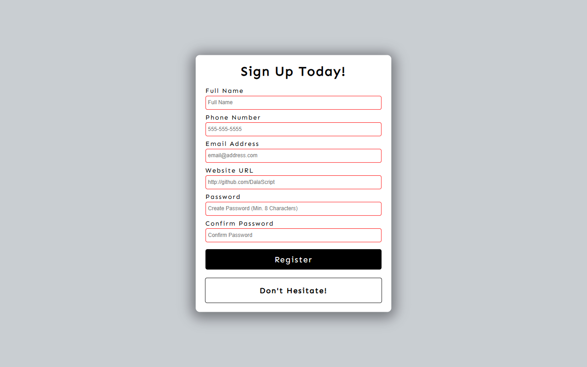

# Form Validation | ZTM JS Web Projects Course

**Project 12/20**

**📋 Form Validation** is a responsive sign-up form built with custom client-side validation using the Constraint Validation API and JavaScript logic. It ensures that users enter valid information, confirms matching passwords, and provides instant feedback through styled messages and input borders — making form submission secure and user-friendly.

---

## 📚 Table of Contents

- [🔎 Overview](#-overview)
  - [📸 Screenshot](#-screenshot)
  - [🔗 Links](#-links)
  - [📌 Features](#-features)
- [🧠 My process](#-my-process)
  - [🛠️ Built with](#️-built-with)
  - [🎓 What I learned](#-what-i-learned)
  - [🔙 Previous Project](#-previous-project)
  - [🔜 Next Project](#-next-project)
  - [🗃️ Useful resources](#️-useful-resources)
- [👤 Author](#-author)
  - [🌐 Connect with Me](#-connect-with-me)
  - [💻 Coding Profiles](#-coding-profiles)

---

## 🔎 Overview

### 📸 Screenshot

### 🔗 Links

 - [🔴 Live Demo](https://dalascript.github.io/form-validator/)
 - [🗂️ GitHub Repository](https://github.com/DalaScript/form-validator)

### 📌 Features

 - ✅ Validates full name, phone, email, website URL, and password
 - ✅ Real-time input validation using built-in HTML attributes and JS
 - ✅ Password strength requirement using RegEx
 - ✅ Confirms password match before submission
 - ✅ Displays clear error/success messages with styled borders
 - ✅ Uses JavaScript to prevent form submission if data is invalid
 - ✅ Stores submitted user data in an object for further use

---

## 🧠 My Process

### 🛠️ Built with

 - HTML5
 - CSS3
 - Vanilla JavaScript
 - Constraint Validation API

### 🎓 What I Learned

 - How to use the Constraint Validation API (`checkValidity`)
 - Implementing custom validation logic with JavaScript
 - Writing regex patterns for strong password rules
 - Creating dynamic success/error UI with border color feedback
 - Structuring form data and capturing it via JS
 - Handling form submission and preventing default behavior
 - Designing user-friendly forms with accessibility in mind

  > 🚀 For me, this project was more about **practice** and gaining additional **experience**,  
  > rather than learning something entirely new.  
  >  
  > 👨‍💻 Since I’m not a beginner and already familiar with these technologies,  
  > I approached it with confidence — and still, I truly **enjoyed working on it**.  
  >  
  > 🎯 Overall, I consider this a very **valuable and enjoyable experience**.

### 🔙 Previous Project

 - Video Player | *[Project 11/20]* → [View Repository](https://github.com/DalaScript/video-player)

### 🔜 Next Project

 - Spock Rock Game | *[Project 13/20]* → [View Repository](https://github.com/DalaScript/spock-rock-game)

### 🗃️ Useful resources

 - [Google Fonts](https://fonts.google.com/) - Free Fonts
 - [RegEx Background Info](https://html.com/attributes/input-pattern/)
 - [RegEx Playground Tool (Password Pattern)](https://regexr.com/3bfsi)
 - [W3Schools - Forms](https://www.w3schools.com/html/html_forms.asp)
 - [W3Schools - Prevent Default](https://www.w3schools.com/jsref/event_preventdefault.asp)
 - [MDN - Input Element](https://developer.mozilla.org/en-US/docs/Web/HTML/Reference/Elements/input)
 - [MDN - Valid Psuedo Class](https://developer.mozilla.org/en-US/docs/Web/CSS/:valid)
 - [MDN - Form Validation](https://developer.mozilla.org/en-US/docs/Learn_web_development/Extensions/Forms/Form_validation)
 - [MDN - Constraint Validation](https://developer.mozilla.org/en-US/docs/Web/HTML/Guides/Constraint_validation)
 - [MDN - Submit Event](https://developer.mozilla.org/en-US/docs/Web/API/HTMLFormElement/submit_event)
 - [CSS Tricks - Different Approaches to Validation Article](https://css-tricks.com/form-validation-part-1-constraint-validation-html/)

---

## 👤 Author

### 🌐 Connect with Me

 - [Instagram](https://www.instagram.com/DalaScript)
 - [YouTube](https://www.youtube.com/@DalaScript)

### 💻 Coding Profiles

 - [freeCodeCamp](https://www.freecodecamp.org/DalaScript)
 - [FrontendMentor](https://www.frontendmentor.io/profile/DalaScript)
 - [GitHub](https://github.com/DalaScript)

*🙌 Thanks for checking out my project! More coming soon. Stay tuned 🚀*